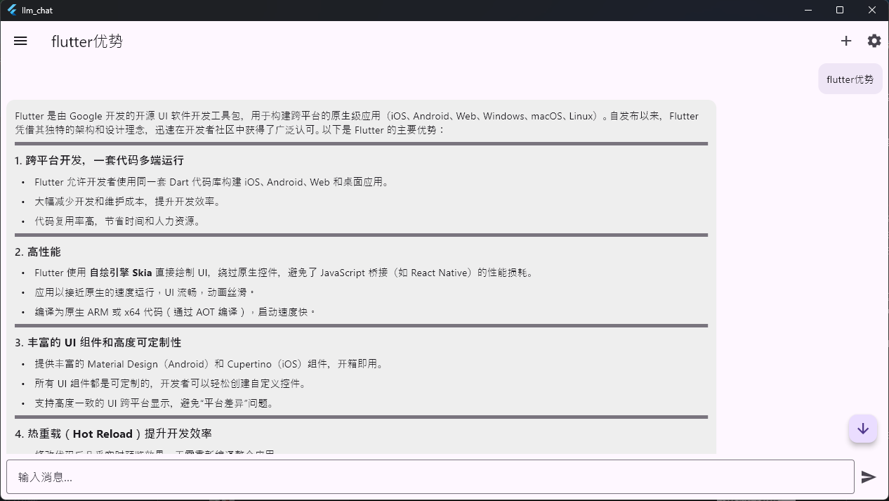
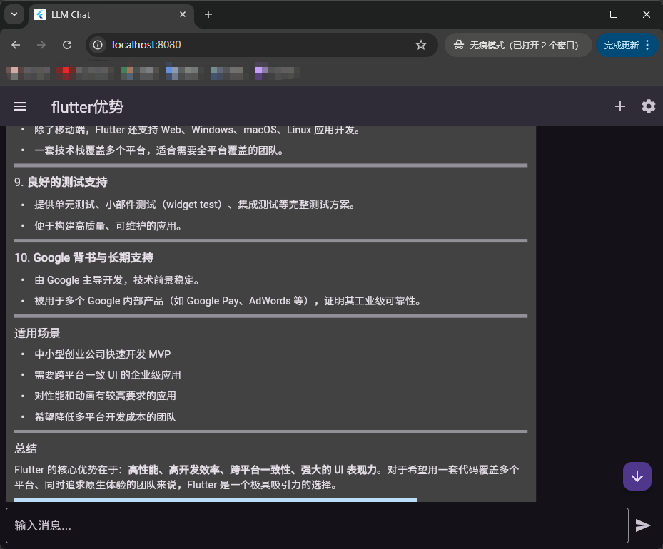
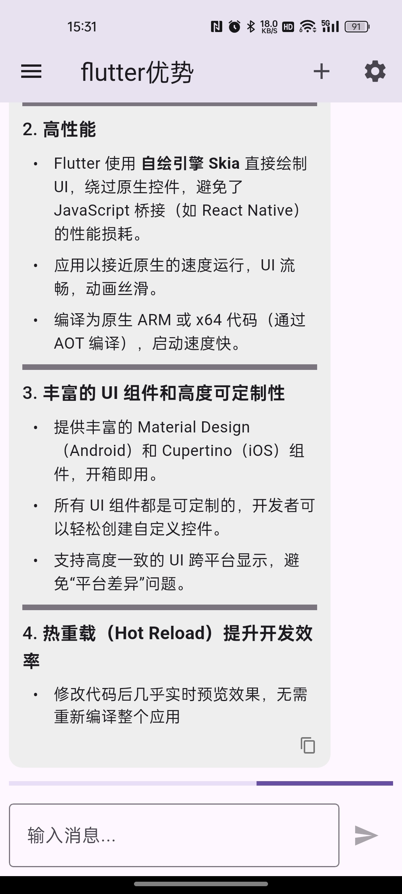

# LLM 对话应用 (LLM Chat Application)

一个全栈大语言模型（LLM）对话应用，支持流式输出（Streaming），体验类似 ChatGPT。基于 Python FastAPI 后端和 Flutter Windows 桌面端构建。





## ✨ 主要特性

*   **💬 流式对话体验**: 支持 OpenAI 格式的流式响应（SSE），实现打字机效果，响应迅速。
*   **📝 Markdown 渲染**: 完美支持代码高亮、表格、列表等 Markdown 格式。
*   **📋 一键复制**: 支持消息内容选择复制及一键复制代码块或整条回复。
*   **🗂️ 多会话管理**: 支持创建多个独立会话，自动保存历史记录。
*   **🔐 用户系统**: 完整的用户注册、登录认证流程。
*   **⚙️ 灵活配置**: 
    *   **模型配置**: 支持自定义 Base URL、API Key 和模型名称（兼容 OpenAI, Ollama, vLLM 等）。
    *   **服务地址**: 登录界面可动态配置后端服务器地址，方便远程连接。
    *   **个性化**: 支持中英文切换及明暗主题模式。
*   **📦 绿色免安装**: Windows 版本打包为便携式文件夹，内置所有运行环境。

## 🏗️ 架构

- **后端**: Python FastAPI (异步处理, SQLAlchemy ORM, Pydantic)
- **数据库**: SQLite (轻量级本地存储)
- **前端**: Flutter (Windows Desktop, Provider 状态管理, Material 3 设计)

## 🚀 快速开始 (Windows Release)

如果您只想运行程序，可以直接使用构建好的发布包：

1. 进入 `dist` 文件夹。
2. 双击运行 **`start_app.bat`**。
3. 该脚本会自动启动后端服务 (`llm_chat_server.exe`) 和前端客户端 (`llm_chat.exe`)。

## 🛠️ 开发与构建指南

### 1. 后端开发 (Backend)

**方式一：使用脚本 (推荐)**
在项目根目录运行：
```powershell
.\start_backend.ps1
```

**方式二：手动运行**
```bash
cd backend
# 安装依赖
pip install -r requirements.txt
# 启动开发服务器
uvicorn main:app --reload --host 0.0.0.0 --port 8000
```

### 2. 前端开发 (Frontend)

```bash
cd frontend
# 获取依赖
flutter pub get
# 运行桌面版
flutter run -d windows
```

### 3. 打包发布 (Build for Release)

本项目支持构建 Windows 桌面版和 Android 移动版。

#### Windows 桌面版
本项目提供了一键打包脚本，可生成无需安装环境的绿色版程序。

**环境要求**:
- Python 3.8+ (已添加到 PATH)
- Flutter SDK (已添加到 PATH)
- Visual Studio 2019+ (C++ 桌面开发工作负载)

**构建步骤**:
在 PowerShell 中运行项目根目录下的脚本：
```powershell
.\build_release.ps1
```

**产物说明**:
脚本运行成功后，会在 `dist/` 目录下生成：
- `llm_chat_server.exe`: 打包后的 Python 后端。
- `llm_chat.exe`: 编译后的 Flutter 客户端。
- `data/`: 包含前端资源、依赖库等。
- `start_app.bat`: 一键启动脚本。

只需将整个 `dist` 文件夹分发给用户即可。

#### Android 移动版 (推荐使用 GitHub Actions)
由于本地配置 Android 开发环境较为繁琐，本项目已配置 GitHub Actions 自动构建流程。

1. **推送代码**: 将代码提交到 GitHub 仓库。
2. **自动构建**: 提交后会自动触发 `Build Android` 工作流。
3. **下载 APK**: 构建完成后，在 GitHub Actions 页面下载 `app-release` 构件（Artifact）。

**本地构建 (可选)**:
如果需要在本地构建 APK，请确保已安装 Android Studio 和 Android SDK。
```bash
cd frontend
flutter build apk --release
```
生成的 APK 位于: `frontend/build/app/outputs/flutter-apk/app-release.apk`


## ⚙️ 使用说明

### 连接配置
1. **服务器地址**: 在登录界面右上角点击 ⚙️ 图标，可修改后端 API 地址（默认为 `http://127.0.0.1:8000`）。
2. **模型参数**: 登录后点击右上角 ⚙️ 图标，配置 LLM 参数：
    *   **Base URL**: 例如 `https://api.openai.com/v1` 或本地 `http://localhost:11434/v1`
    *   **API Key**: 你的 API 密钥
    *   **Model Name**: 模型名称（如 `gpt-4`, `llama3`）

### 常见问题
*   **注册失败**: 确保后端服务已启动且数据库文件 (`sql_app.db`) 有写入权限。
*   **无法连接**: 检查防火墙设置，或确认登录界面的服务器地址配置正确。
